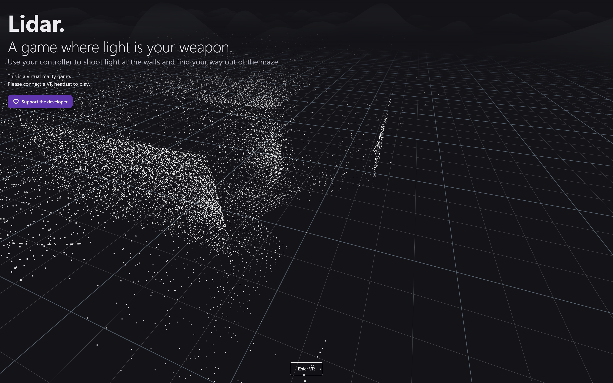
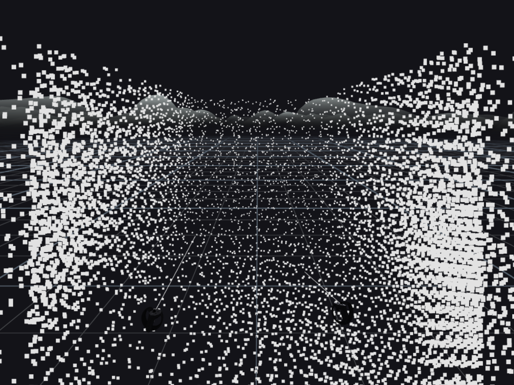

# VR Game

A virtual reality game where you have to find your way out of a maze you can't see. Use your VR Game (basically a laser coupled with a light sensor) to find your way out and avoid the obstacles.

_Disclaimer: This project is still in early development. The game is playable but many features are still missing, and will hopefully be added in the future._

## Inspiration

This game is inspired by **[datæ](https://steamcommunity.com/id/75651121243836)**'s Garry's Mod Addon VR Game[^1], an experimental game-mode which allows players to scan a map. The horror mechanic is pretty powerful, as no moving entity can be seen as long as the player has not scanned it. This allows for some pretty scary situations, especially in VR, where the scale of the environment is much more apparent.

As a matter of fact, VR Game is an actual technology used in a broad range of applications, such as autonomous vehicles, robotics, and even in the medical field. It is a laser-based system that, as its name suggests, uses a laser to scan the environment and detect the distance to objects.

The laser is coupled with a light sensor, which detects the reflected light and allows the system to determine the distance to the object. It is usually pulsed at a reasonably low frequency (2-10 Hz), and the sensor measures the time between the pulse and the reflected light. The system is commonly mounted on a rotating platform, which allows it to scan a 360° field of view.

|  |
| -------------------------------------------------- |
| Schematic of an autonomous car VR Game module[^2]. |

In this game, the module is mounted on the player's controller. When enabled, an array of lasers is fired from the controller, and the reflected light is detected by the sensor, which generates on each pulse a low resolution depth map. Coupled to the direction of the controller, this allows the system to generate a point cloud of the environment.

## Usage

You can also download the source code and run it locally. It is written in TypeScript React, uses [Joy-UI](https://mui.com/) for the UI and [Three.js](https://threejs.org/) for WebGL and WebXR rendering.

To scan your surroundings, use your right controller to point the laser array at any surface. Squeeze the trigger to start capturing point cloud data, and release it to stop. The captured data will be displayed as a point cloud in the scene.

Currently, movement is not implemented, so you can only scan a small part of the maze. Obviously, you could just move around in the real world, but since the maze is approximately 40m x 40m, it would be a bit impractical.

## Screenshots

|                                                                                                                                                                                              |
| -------------------------------------------------------------------------------------------------------------------------------------------------------------------------------------------------------------------------------------- |
| Overview of the scanned maze. Here, the player has placed his controller over the wall, in order to scan otherwise inaccessible areas. As expected, the point cloud is less dense in regions located further away from the controller. |

|                                                                                                           |
| --------------------------------------------------------------------------------------------------------------------------------------------------- |
| Another point of view of the same scene. One can identify the grid pattern of the point cloud, which is due to the laser array being square-shaped. |

|                                                                                                                                                                                     |
| ----------------------------------------------------------------------------------------------------------------------------------------------------------------------------------------------------------------------------- |
| Here is a first person view of the maze (in VR mode, recorded using the WebXR extension[^3] by Mozilla), the controllers are barely visible due to poor contrast, but can still be discerned in the bottom half of the image. |

## Performance

The current implementation of the point cloud rendering is pretty basic, with points being saved in a fixed-length vertex buffer, which is then displayed as a mesh with a point cloud material. This comes with several limitations:

- The amount of rendered points is limited by the size of the vertex buffer. This is currently set to 100000 points, therefore going unnoticed as long as the user does not move around too much, but it will become a problem as soon as locomotion is implemented.
- The buffer being of fixed size, it is initialized with a default value, which is currently set to (0, 0, 0). This means that the point cloud will be displayed in the origin of the world, looking like a big glitchy cluster of white dots.

Still, some optimizations have been implemented to improve the performance of the point cloud generation, and more specifically the ray casting and collision detection. When it comes accelerating this process, three-mesh-bvh[^4] has been a life-saver, allowing for incredibly fast and accurate results with intricate meshes.
